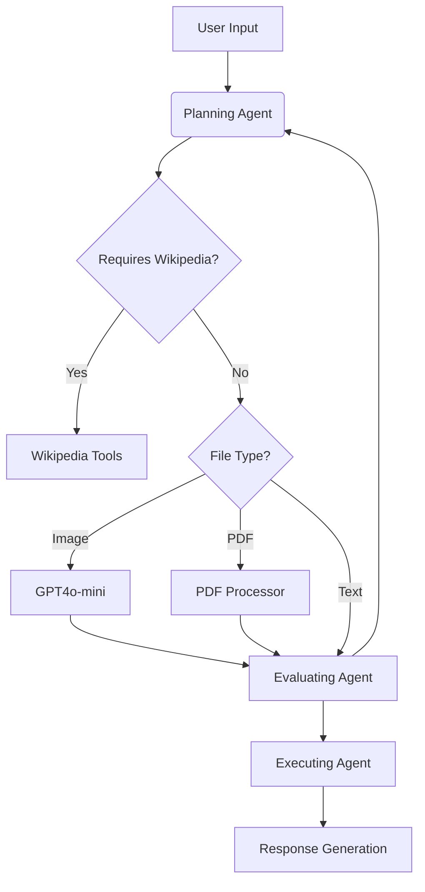

# 🌿 EcoBot: AI-Powered Ecological Assistant with Agentic Workflow

EcoBot is an intelligent ecological assistant that combines **multi-agent architecture** with **domain-specific tools** to provide scientifically accurate responses. Leveraging GPT-4o Mini and a sophisticated agentic workflow, it offers robust species identification, ecological analysis, and research paper processing capabilities.


---

## 🚀 Key Features

- **Agentic Workflow Architecture** (Planner → Evaluator → Executor)
- **Multi-Modal Analysis**: Images, PDFs, and text queries
- **Scientific Validation**: Wikipedia integration for taxonomic verification
- **Context-Aware Processing**: Maintains conversation context across sessions
- **BioTrove-CLIP Integration**: Specialized biological image classification

---

## 🧠 Architecture: Agentic Workflow

EcoBot implements a three-stage agentic pipeline to ensure accurate and reliable responses:



### Core Components

1. **Planning Agent** (`planner.py`)
   - Analyzes user intent using GPT-4o Mini
   - Selects appropriate tools (Wikipedia/Image/PDF/GPT)
   - Generates initial execution plan

2. **Evaluating Agent** (`evaluator.py`)
   - Validates tool selection against domain rules
   - Checks for recent duplicate queries
   - Approves or revises execution plans

3. **Executing Agent** (`executor.py`)
   - Orchestrates tool-specific operations:
     - `wiki_tool.py`: Wikipedia API integration
     - `image_tools.py`: BioTrove-CLIP + GPT-4o vision
     - `pdf_tools.py`: Research paper analysis
   - Maintains conversation context
   - Formats final response with sources

---

## 📂 Directory Structure

```
namikazi25-ecobot/
├── app.py                 # Streamlit frontend
├── backend/
│   ├── agents/            # Core decision-making components
│   │   ├── evaluator.py   # Plan validation
│   │   ├── executor.py    # Tool execution
│   │   └── planner.py     # Initial strategy
│   ├── tools/             # Domain-specific capabilities
│   │   ├── image_tools.py # Vision processing
│   │   ├── pdf_tools.py   # Document analysis
│   │   └── wiki_tool.py   # Fact verification
│   └── utils/             # Shared functionality
└── tests/                 # Comprehensive test suite
```

---

## 🛠️ Installation & Usage

### Prerequisites
- Python 3.9+
- OpenAI API key

### Quick Start

1. **Clone repository**
   ```bash
   git clone https://github.com/namikazi25/ecobot.git
   cd ecobot
   ```

2. **Install dependencies**
   ```bash
   pip install -r requirements.txt
   ```

3. **Configure environment**
   ```bash
   echo "OPENAI_API_KEY=your_key_here" > .env
   ```

4. **Launch system**
   ```bash
   # Start backend
   cd backend && uvicorn main:app --reload
   
   # In new terminal
   streamlit run app.py
   ```


## 📚 Knowledge Base

EcoBot prioritizes scientific accuracy through:
- **GPT4o-mini Model**: Biological image classification
- **Wikipedia Verification**: Taxonomic data validation
- **Research Paper Analysis**: PDF text extraction + GPT synthesis

---
🤝 How to Contribute
We welcome contributions from developers, ecologists, and AI enthusiasts! Here's how you can help:
- Report Issues: Found a bug? Open an issue
- Suggest Enhancements: Have an idea? Start a discussion
- Submit PRs:
- Improve vision processing in image_tools.py
- Enhance PDF analysis in pdf_tools.py
- Expand ecological knowledge base
- First-time contributors are especially welcome!
---

<p align="center">
  "Empowering ecological exploration through intelligent agentic workflows" 🌍
</p>
