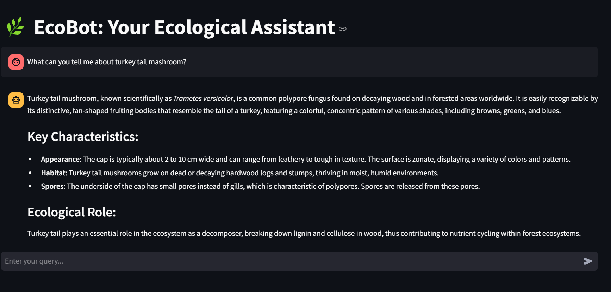

# 🌱 EcoBot: AI-Powered Ecological Assistant

EcoBot is a chatbot built to empower ecological exploration and species identification. It leverages **GPT-4o Mini** for intelligent responses, supports **chat history persistence**, and can **analyze images and PDFs** to provide insights into biodiversity, species traits, and ecological questions.


---

## 🚀 Features

- **Streamlit Frontend**: A simple and intuitive chatbot interface.
- **FastAPI Backend**: Receives requests, processes files, and interacts with GPT-4o Mini.
- **File Uploads**: Supports image (JPEG, PNG) and PDF uploads for analysis.
- **Chat History**: Maintains context across conversations.
- **BioTrove-CLIP Model**: Zero-shot image classification for species identification.

---

## 📂 Directory Structure

```bash
namikazi25-ecohack/
├── README.md              # Project documentation
├── app.py                 # Streamlit app (front-end)
├── requirements.txt       # Python dependencies
├── assests/
│   └── biotrove-test.avif # Sample asset
├── backend/
│   ├── gpt_handler.py     # GPT-4o Mini integration
│   ├── image_classifier.py# BioTrove-CLIP classification
│   ├── main.py            # FastAPI server
│   └── __pycache__/
├── tests/
│   ├── test_image_classifier.py
│   └── __pycache__/
└── .streamlit/
    └── config.toml        # Streamlit configuration
```

1. **`app.py`**  
   The Streamlit application that provides the chatbot UI.  
2. **`requirements.txt`**  
   Includes all Python packages needed to run EcoBot.  
3. **`backend/`**  
   - **`main.py`**: Defines the FastAPI endpoints and orchestrates GPT-4o interactions.  
   - **`gpt_handler.py`**: Core logic for handling queries, PDFs, images, and GPT-4o queries.  
   - **`image_classifier.py`**: Uses BioTrove-CLIP for image-based species classification.  
4. **`tests/`**  
   Contains unit tests for the `image_classifier.py`.  
5. **`.streamlit/`**  
   Contains Streamlit configuration files.

---

## 🛠️ Setup Instructions

1. **Clone the Repository**

   ```bash
   git clone https://github.com/namikazi25/Ecobot.git
   cd ecobot
   ```

2. **Create a Virtual Environment**

   ```bash
   python -m venv venv
   # macOS/Linux
   source venv/bin/activate
   # Windows
   venv\Scripts\activate
   ```

3. **Install Dependencies**

   ```bash
   pip install -r requirements.txt
   ```

4. **Set Environment Variables**

   Create a `.env` file in the project root and add your OpenAI API key:

   ```bash
   OPENAI_API_KEY=your-openai-api-key
   ```

---

## ▶️ Usage

1. **Start the FastAPI Backend**

   ```bash
   cd backend
   uvicorn main:app --reload
   ```

   The backend will be accessible at `http://127.0.0.1:8000`.

2. **Run the Streamlit Frontend**

   In a new terminal, navigate to the project root and run:

   ```bash
   streamlit run app.py
   ```

   Open the local URL provided in your terminal to access the EcoBot interface.

---

## 🤖 How It Works

1. **User Input**  
   - You can upload an image or PDF (optional).
   - Then type your ecological question or request in the chat input.

2. **Request Handling**  
   - The Streamlit frontend sends your message (and any file) to the FastAPI backend.

3. **GPT-4o Mini Integration**  
   - The backend calls GPT-4o Mini with the current query, any relevant chat history, and the file content.

4. **Response**  
   - GPT-4o Mini returns a detailed answer, which is displayed in the chat UI.
   - Any species classifications are assisted by the BioTrove-CLIP model for image analysis.

---

## 📌 Troubleshooting

- **Field Required Error**  
  Ensure `history` is sent as `json.dumps(history)` when making requests to the backend.

- **Chatbot Forgets Messages**  
  Make sure `st.session_state.messages` is properly maintained in `app.py`.

- **File Uploads Not Working**  
  Verify that files are being sent via `files=files` in your `requests.post()` to the FastAPI endpoint.

- **API Key Missing**  
  Make sure your `.env` file contains `OPENAI_API_KEY`.


<p align="center">
  <strong>Thank you for using EcoBot! Together, let's explore and protect our planet's biodiversity. 🌏</strong>
</p>
